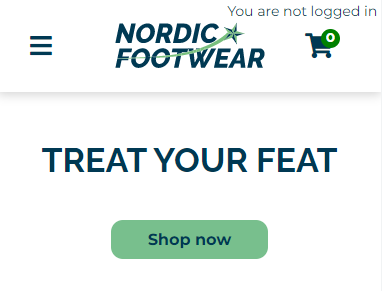

# Nordic Footwear // E-commerce site

A simple overview of the use/purpose of the project.

## Description
An e-commerce project to test the use of localstorage and API's, including multiple pages.

- Design
- Incl home, product list, product detail and cart pages
- Admin pages
- Responsive all devices

## Built with
- Vanilla coding
- SASS
- Bootstrap

## Getting Started
### Installing

1. Clone the repo:
'''
git clone https://github.com/Noroff-FEU-Assignments/project-exam-2-thorerik88.git
'''

2. Install the dependencies:
'''
npm install
'''

3. Open File:
'''
Open the file 'index.html' in your browser and start exploring
'''

## Contact

[My facebook page](https://www.facebook.com/profile.php?id=588541828)
[My LinkedIn page](https://www.linkedin.com/in/thor-erik-st%C3%B8vland-ab4bb993/)
